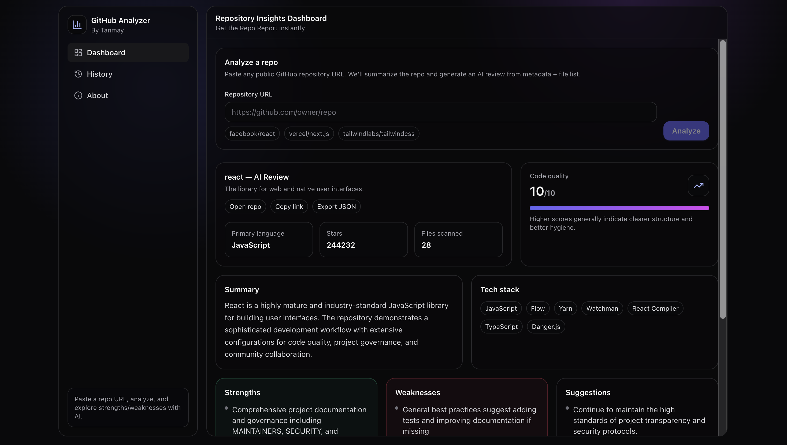
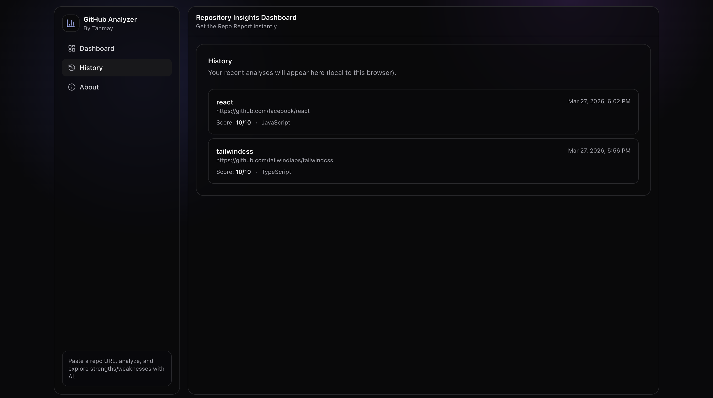

# 🚀 AI GitHub Project Analyzer

An AI-powered web application that analyzes GitHub repositories and generates structured insights including summary, tech stack, code quality score, strengths, weaknesses, and suggestions.

---

## Links
[🌐 Live Demo](https://github-analyzer-frontend-one.vercel.app/) • [⚙️ Backend API](https://github-analyzer-backend-vleh.onrender.com/)

## 🔥 Features

- 🔍 Analyze any public GitHub repository  
- 🤖 AI-powered code review using LLMs  
- 📊 Visual score representation (charts)  
- 🧠 Tech stack detection  
- ✅ Strengths & ⚠️ Weaknesses analysis  
- 💡 Improvement suggestions  
- 🕘 History feature (view past analyses)  
- ⚡ Optimized backend with:
  - Important file filtering  
  - API rate handling  

---

## 🖥️ Demo Screenshots

### 🔹 Main Dashboard

### 🔹 History Section

---

## 🏗️ Tech Stack

### Frontend
- React (Vite)
- Recharts
- CSS (Glassmorphism UI)

### Backend
- Node.js
- Express.js
- GitHub API

### AI Integration
- Google Gemini (Primary)

---

## ⚙️ Setup

### Backend

cd backend  
npm install  

Create .env:

PORT=5000  
GITHUB_TOKEN=your_token  
GEMINI_API_KEY=your_key  

npm start  

---

### Frontend

cd frontend  
npm install  

npm run dev  

---

### Deployment (recommended)

From the repo root:

npm install  

npm run build  

npm start  

This builds the React app, copies the `frontend/dist` output into `backend/public`, and starts the Express backend serving the built frontend.

---

## 📡 API

POST /api/analyze  

{
  "repoUrl": "https://github.com/user/repo"
}

---

## 🧠 Highlights
 
- Optimized GitHub data extraction  
- Structured AI output  
- Modern responsive UI  

---

## 👨‍💻 Author

Tanmay Pardhi  
https://github.com/codevdtanmay 

---

## ⭐ Support

Give a ⭐ if you like this project!
